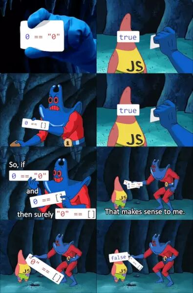

# 运算符和类型转换

~~位运算符 / 成员运算符~~/逻辑运算符/算术运算符/比较运算符/赋值运算符

## 逻辑运算符

### `&&`逻辑与 

`&&`前后分别添加一个表达式，对表达式结果进行判断。会有一个返回值

`a && b`:    如果a的结果为真，则返回b，否则返回a

```js
a?b:a//等价式
```

其中判断是否为真有强制类型转换: `0` `undefined` `null` `NaN` `false` `""`，这些结果为`false`，其余为`true`

### `||` 逻辑或

`a || b`:    如果a的结果为真，则返回a，否则返回b

```js
a?a:b//等价式
```

也有强制类型转换

### `!` 逻辑非

一切数据类型都可以求逻辑非，结果将强制转换成布尔型数据

`!a`:    如果a的结果为真，则返回`false`，否则为`true`

```js
a?false:true//等价式
```

也有强制类型转换


## 算术运算符

加法有两个含义：拼接或者加

```js
"asd"+"fgh"//"asdfgh"字符串拼接
```

返回两个数据的和、差、积、商、取余，有`NaN`非数值参与返回`NaN`    
NaN意为损坏的数字，比如除数为0时得到

```js
let a = 5,
    b = 2;
a+b;//7
a+NaN;//NaN
a-b;//3
a*b;//10
a/b;//2.5
a%b;//1
```

正常数值比较符合预期，但是不同的数据类型也可以进行算术运算

### 自加自减

```js
var a = 1;
console.log(++a);//2,先自增，再返回值
console.log(a);//2
a = 1;
console.log(a++);//1,先返回，再自增
console.log(a);//2
```

`--`和`++`是同理的

```js
var a = 1;
console.log((++a)+(a++)+(++a));//2 + 2 + 4 = 8
//在单个运算中运算完之后再增加，但是谁写这样的代码都是找锤，请少用。
```


## 比较运算符

 `>` ` <` `==`  `===`  `>=` `<=` `!=` `!==`

将两个变量进行比较，返回`true`或者`false`

```js
3>2;//true
3<2;//false
3==3;//true 类型不一样也可以相等
3==='3'//false 类型一样的前提下才可能相等
2>=2;//true
2<=2;//true
3!=2;//true
3!=='3';//true 同理的不等于
```

特别的，NaN和NaN比较永远不会相等


## 赋值运算符

### 赋值`=`

将 `=` 后面的值传递到`=`号前面的储存空间当中

```js
let a = 1;//等号右边的值是1，传递到等号左边的储存空间，打印a显示1
let b = a;//等号右边a的值是1，同样传递，打印b显示1
```

### 追加赋值`+=`

`a = a+1`  除了可以写成`a++`可以简写为 `a += 1`  其他运算符如`-=`同理。    
`=+`  `+=++` 等只会在试题中出现，请不要使用。

其中赋值操作两大类：分为字面量和引用类型。    
对引用类型的赋值相当于**起别名**。


## 类型转换

js是动态类型语言，所以类型不同的时候进行运算会进行类型转换:     
其中 数值 布尔 字符串 对象 `null` `undefined`都可以强制类型转换    
但是转换目标一般是数值，布尔，字符串

### 转字符串:

任何类型变量转字符串可以简单理解为将变量值加上引号    
底层是对变量使用`toString`方法   
在不理解的情况下可以在控制台打出`(""+变量)`测试    
特别的，对象会转换成`"[object Object]"`，数组会去括号后首尾加`"`;

```js
({}).toString();//加括号是因为区分对象与代码块，此代码与下一行值一样
""+{};//"[object Object]"
""+null;//"null"
""+undefined;//"undefined"
""+[1,23,3];//"1,23,3"去中括号
""+123123;//"123123"
""+NaN;//"NaN"
""+false;//“false”

//String()也有转字符串的效果
String([]);//""
```

以上是基础，很重要，花时间掌握。


### 转数值

`Number()`传入变量    
`null`和`""`和`false`会转成`0`，`true`会转成`1`，`"Infinity"`和`"-Infinity"`会转换成`Infinity`和`-Infinity`，    
其余都是调用`toString()`如果是数值形式，就转数值，不然就是`NaN`

```js
Number("123");//123
+'123';//同上等价，强制转数值，也可使用如 1*

//特别的，单成员数组取第[0]项
Number([]);//0
Number(['']);//0
Number([9]);//0
//其余情况是的数组是NaN
Number([true]);//NaN
Number([0,1,2]);//NaN
```


### 转布尔型：

`Boolean()`传入变量    
`0` `NaN`  `""` `null` `undefined` 直接转换成`false`，其余先转换成字符串再转布尔，其余都是真，这是判断的基准

```js
Boolean({});//true  空对象也是对象
Boolean([]);//true  数组也属于对象
!!{};//等价上，true
```

并不是所有的NaN转布尔值都是`false`，比如日期类NaN    
`isNaN()`函数可以判断变量是否为NaN。


### 隐式类型转换

#### 算数运算符带来的转换

有字符串时加法运算符会把其余类型转换成字符串

```js
"123" + 3;//1233
3 + "1";//31
```

其余非数值类型加法会先转数值(如果可以的话)，如果不行，转成字符串转再数值加(转数值的方法)

```js
123 + null//null转数值时0，结果为123
0 + undefined//undefined转数值为NaN,结果为NaN
```

`-`或者`*`或者`/`或者`%`优先转数值，同上

#### 逻辑运算符带来的转换

比如：

```js
let a = null;
if(a){console.log(1)}//判断a是否为空
```

此时会强制类型转换为`boolean`型

#### 比较运算符带来的转换

两个不同类型的变量用比较运算符`==`，    
也是转化为数值，布尔，字符串再比较。    
转换的优先级有时候让人怀疑人生：

