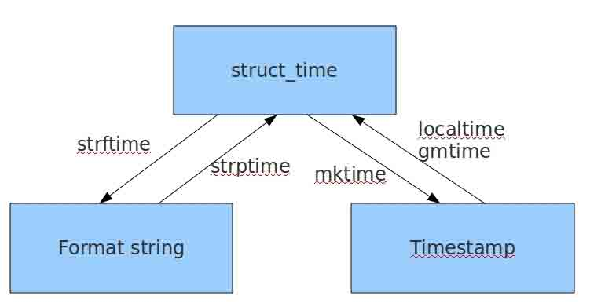
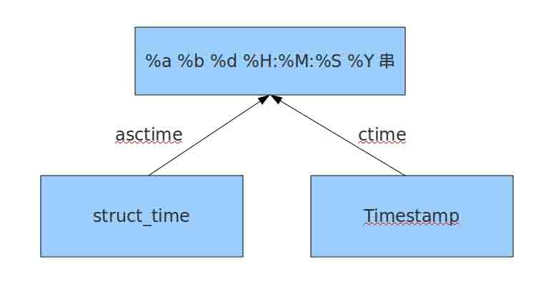

# 时间有关模块


## time模块

导入模块。

```python
#常用方法
1.time.sleep(secs)
#(线程)推迟指定的时间运行。单位为秒。
2.time.time()
#获取当前时间戳
```

 

**表示时间的三种方式**

在Python中，通常有这三种方式来表示时间：时间戳、元组(struct_time)、格式化的时间字符串：

- 时间戳(timestamp) ：

  通常来说，时间戳表示的是从1970年1月1日00:00:00开始按秒计算的偏移量。我们运行“type(time.time())”，返回的是float类型。

- 格式化的时间字符串(Format String)：

   ‘1999-12-06’


```txt
%y 两位数的年份表示（00-99）
%Y 四位数的年份表示（000-9999）
%m 月份（01-12）
%d 月内中的一天（0-31）
%H 24小时制小时数（0-23）
%I 12小时制小时数（01-12）
%M 分钟数（00=59）
%S 秒（00-59）
%a 本地简化星期名称
%A 本地完整星期名称
%b 本地简化的月份名称
%B 本地完整的月份名称
%c 本地相应的日期表示和时间表示
%j 年内的一天（001-366）
%p 本地A.M.或P.M.的等价符
%U 一年中的星期数（00-53）星期天为星期的开始
%w 星期（0-6），星期天为星期的开始
%W 一年中的星期数（00-53）星期一为星期的开始
%x 本地相应的日期表示
%X 本地相应的时间表示
%Z 当前时区的名称
%% %号本身
```


(3)元组(struct_time) ：struct_time元组共有9个元素共九个元素:(年，月，日，时，分，秒，一年中第几周，一年中第几天等）

| 索引（Index） | 属性（Attribute）         | 值（Values）       |
| ------------- | ------------------------- | ------------------ |
| 0             | tm_year（年）             | 比如2011           |
| 1             | tm_mon（月）              | 1 - 12             |
| 2             | tm_mday（日）             | 1 - 31             |
| 3             | tm_hour（时）             | 0 - 23             |
| 4             | tm_min（分）              | 0 - 59             |
| 5             | tm_sec（秒）              | 0 - 60             |
| 6             | tm_wday（weekday）        | 0 - 6（0表示周一） |
| 7             | tm_yday（一年中的第几天） | 1 - 366            |
| 8             | tm_isdst（是否是夏令时）  | 默认为0            |

 首先，我们先导入time模块，来认识一下python中表示时间的几种格式：


```python
#导入时间模块
>>>import time

#时间戳
>>>time.time()
1500875844.800804

#时间字符串
>>>time.strftime("%Y-%m-%d %X")
'2017-07-24 13:54:37'
>>>time.strftime("%Y-%m-%d %H-%M-%S")
'2017-07-24 13-55-04'

#时间元组:localtime将一个时间戳转换为当前时区的struct_time
>>>time.localtime()
time.struct_time(tm_year=2017, tm_mon=7, tm_mday=24,
　　　　　　　　　　tm_hour=13, tm_min=59, tm_sec=37, 
                 tm_wday=0, tm_yday=205, tm_isdst=0)
```


小结：时间戳是计算机能够识别的时间；时间字符串是人能够看懂的时间；元组则是用来操作时间的

**几种格式之间的转换**



```python
#时间戳-->结构化时间
#time.gmtime(时间戳)    #UTC时间，与英国伦敦当地时间一致
#time.localtime(时间戳) #当地时间。例如我们现在在北京执行这个方法：与UTC时间相差8小时，UTC时间+8小时 = 北京时间 
>>>time.gmtime(1500000000)
time.struct_time(tm_year=2017, tm_mon=7, tm_mday=14, tm_hour=2, tm_min=40, tm_sec=0, tm_wday=4, tm_yday=195, tm_isdst=0)
>>>time.localtime(1500000000)
time.struct_time(tm_year=2017, tm_mon=7, tm_mday=14, tm_hour=10, tm_min=40, tm_sec=0, tm_wday=4, tm_yday=195, tm_isdst=0)

#结构化时间-->时间戳　
#time.mktime(结构化时间)
>>>time_tuple = time.localtime(1500000000)
>>>time.mktime(time_tuple)
1500000000.0
```


```python
#结构化时间-->字符串时间
#time.strftime("格式定义","结构化时间")  结构化时间参数若不传，则显示当前时间
>>>time.strftime("%Y-%m-%d %X")
'2017-07-24 14:55:36'
>>>time.strftime("%Y-%m-%d",time.localtime(1500000000))
'2017-07-14'

#字符串时间-->结构化时间
#time.strptime(时间字符串,字符串对应格式)
>>>time.strptime("2017-03-16","%Y-%m-%d")
time.struct_time(tm_year=2017, tm_mon=3, tm_mday=16, tm_hour=0, tm_min=0, tm_sec=0, tm_wday=3, tm_yday=75, tm_isdst=-1)
>>>time.strptime("07/24/2017","%m/%d/%Y")
time.struct_time(tm_year=2017, tm_mon=7, tm_mday=24, tm_hour=0, tm_min=0, tm_sec=0, tm_wday=0, tm_yday=205, tm_isdst=-1)
```



```python
#结构化时间 --> %a %b %d %H:%M:%S %Y串
#time.asctime(结构化时间) 如果不传参数，直接返回当前时间的格式化串
>>>time.asctime(time.localtime(1500000000))
'Fri Jul 14 10:40:00 2017'
>>>time.asctime()
'Mon Jul 24 15:18:33 2017'

#时间戳 --> %a %b %d %H:%M:%S %Y串
#time.ctime(时间戳)  如果不传参数，直接返回当前时间的格式化串
>>>time.ctime()
'Mon Jul 24 15:19:07 2017'
>>>time.ctime(1500000000)
'Fri Jul 14 10:40:00 2017' 
```

### 计算时间差

```python
import time
true_time=time.mktime(time.strptime('2017-09-11 08:30:00','%Y-%m-%d %H:%M:%S'))
time_now=time.mktime(time.strptime('2017-09-12 11:00:00','%Y-%m-%d %H:%M:%S'))
dif_time=time_now-true_time
struct_time=time.gmtime(dif_time)
print('过去了%d年%d月%d天%d小时%d分钟%d秒'%(struct_time.tm_year-1970,struct_time.tm_mon-1,
struct_time.tm_mday-1,struct_time.tm_hour,
struct_time.tm_min,struct_time.tm_sec))

#关于计算时间差，这只是一个练习，后面有datetime模块可以回避闰年等问题
```


## datetime模块

### 类

|     类名      |                          功能说明                          |
| :-----------: | :--------------------------------------------------------: |
|     date      |           日期对象,常用的属性有year, month, day            |
|     time      |                          时间对象                          |
|   datetime    | 日期时间对象,常用的属性有hour, minute, second, microsecond |
| datetime_CAPI |                   日期时间对象C语言接口                    |
|   timedelta   |              时间间隔，即两个时间点之间的长度              |
|    tzinfo     |                        时区信息对象                        |

### 常量

|  常量   |       功能说明       |       用法       | 返回值 |
| :-----: | :------------------: | :--------------: | :----: |
| MAXYEAR | 返回能表示的最大年份 | datetime.MAXYEAR |  9999  |
| MINYEAR | 返回能表示的最小年份 | datetime.MINYEAR |   1    |

### date类

date对象由year年份、month月份及day日期三部分构成 

```python
date（year，month，day) 
```

 通过year, month, day三个数据描述符可以进行访问 

```python
>>> a = datetime.date.today()
>>> a
datetime.date(2017, 3, 22)
>>> a.year
2017
>>> a.month
3
>>> a.day
22 
```

当然，你也可以用`__getattribute__(...)`方法获得上述值

```python
>>> a.__getattribute__('year')
2017
>>> a.__getattribute__('month')
3
>>> a.__getattribute__('day')
22
```

### date对象中包含的方法与属性

用于日期比较大小的方法

| `方法名`      | `方法说明`     | `用法`          |
| ------------- | -------------- | --------------- |
| `__eq__(…)`   | 等于(x==y)     | `x.__eq__(y)`   |
| `__ge__(…)`   | 大于等于(x>=y) | `x.__ge__(y)`   |
| `__gt__(…)`   | 大于(x>y)      | `x.__gt__(y)`   |
| ` __le__(…) ` | 小于等于(x<=y) | ` x.__le__(y) ` |
| ` __lt__(…) ` | 小于(x<y)      | ` x.__lt__(y) ` |
| ` __ne__(…) ` | 不等于(x!=y)   | ` x.__ne__(y) ` |

以上方法的返回值为True\False  示例如下

```python
>>> a=datetime.date(2017,3,1)
>>> b=datetime.date(2017,3,15)
>>> a.__eq__(b)
False
>>> a.__ge__(b)
False
>>> a.__gt__(b)
False
>>> a.__le__(b)
True
>>> a.__lt__(b)
True
>>> a.__ne__(b)
True
```

#### 获得二个日期相差多少天

使用`__sub__(...)`和`__rsub__(...)`方法，其实二个方法差不太多，一个是正向操作，一个是反向操作： 

| 方法名        | 方法说明 | 用法            |
| ------------- | -------- | --------------- |
| `__sub__(…)`  | x - y    | `x.__sub__(y)`  |
| `__rsub__(…)` | y - x    | `x.__rsub__(y)` |

```python
>>> a
datetime.date(2017, 3, 22)
>>> b
datetime.date(2017, 3, 15)
>>> a.__sub__(b)
datetime.timedelta(7)
>>> a.__rsub__(b)
datetime.timedelta(-7)
#计算结果的返回值类型为datetime.timedelta, 如果获得整数类型的结果则按下面的方法操作：
>>> a.__sub__(b).days
7
>>> a.__rsub__(b).days
-7
```

#### ISO标准化日期

如果想要让所使用的日期符合ISO标准，那么使用如下三个方法:  

```python
#.isocalendar():返回一个包含三个值的元组，三个值依次为：year年份，week number周数，weekday星期数（周一为1…周日为7)：
>>> a = datetime.date(2017,3,22)
>>> a.isocalendar()
(2017, 12, 3)
>>> a.isocalendar()[0]
2017
>>> a.isocalendar()[1]
12
>>> a.isocalendar()[2]
3

#.isoformat(...): 返回符合ISO 8601标准 (YYYY-MM-DD) 的日期字符串； 
>>> a = datetime.date(2017,3,22)
>>> a.isoformat()
'2017-03-22'

#.isoweekday(...): 返回符合ISO标准的指定日期所在的星期数（周一为1…周日为7)
>>> a = datetime.date(2017,3,22)
>>> a.isoweekday()
3

#与isoweekday(...)相似的还有一个weekday(...)方法，只不过是weekday(...)方法返回的周一为 0, 周日为 6 
>>> a = datetime.date(2017,3,22)
>>> a.weekday()
2

```

#### 其他方法与属性

```python
#timetuple(...):该方法为了兼容time.localtime(...)返回一个类型为time.struct_time的数组，但有关时间的部分元素值为0
#toordinal(...)：返回公元公历开始到现在的天数。公元1年1月1日为1
#replace(...)：返回一个替换指定日期字段的新date对象。参数3个可选参数，分别为year,month,day。注意替换是产生新对象，不影响原date对象。
#resolution：date对象表示日期的最小单位。这里是天。
#fromordinal(...)：将Gregorian日历时间转换为date对象；Gregorian Calendar ：一种日历表示方法，类似于我国的农历，西方国家使用比较多。
#fromtimestamp(...)：根据给定的时间戮，返回一个date对象
#today(...)：返回当前日期
#max： date类能表示的最大的年、月、日的数值
#min： date类能表示的最小的年、月、日的数值
```

#### 日期的字符串输出

如果你想将日期对象转化为字符串对象的话，可以用到`__format__(...)`方法以指定格式进行日期输出：

```python
>>> a = datetime.date(2017,3,22)
>>> a.__format__('%Y-%m-%d')
'2017-03-22'
>>> a.__format__('%Y/%m/%d')
'2017/03/22'
>>> a.__format__('%y/%m/%d')
'17/03/22'
>>> a.__format__('%D')
'03/22/17'
```

与此方法等价的方法为strftime(...)

```python
>>> a = datetime.time(12,20,59,899)
>>> a.strftime('%H:%M:%S')
'12:20:59'
```
ISO标准输出 

如果要使输出的时间字符符合ISO标准，请使用isoformat(...):

```python
>>> a = datetime.time(12,20,59,899)
>>> a.isoformat()
'12:20:59.000899'
```
如果只是相简单的获得时间的字符串，则使用`__str__(...)`
```python
>>> a = datetime.time(12,20,59,899)
>>> a.__str__()
'12:20:59.000899'
```
### datetime类

数据构成
datetime类其实是可以看做是date类和time类的合体，其大部分的方法和属性都继承于这二个类，相关的操作方法请参阅，本文上面关于二个类的介绍。其数据构成也是由这二个类所有的属性所组成的。

```python
 datetime(year, month, day[, hour[, minute[, second[, microsecond[,tzinfo]]]]])
```
专属于datetime的方法和属性
1、 date(…)：返回datetime对象的日期部分：
```python
>>> a = datetime.datetime.now()
>>> a
datetime.datetime(2017, 3, 22, 16, 9, 33, 494248)
>>> a.date()
datetime.date(2017, 3, 22)
```
time(…)：返回datetime对象的时间部分：
```python
>>> a = datetime.datetime.now()
>>> a
datetime.datetime(2017, 3, 22, 16, 9, 33, 494248)
>>> a.time()
datetime.time(16, 9, 33, 494248)
```
utctimetuple(…)：返回UTC时间元组：
```python
>>> a = datetime.datetime.now()
>>> a
datetime.datetime(2017, 3, 22, 16, 9, 33, 494248)
>>> a.utctimetuple()
time.struct_time(tm_year=2017, tm_mon=3, tm_mday=22, tm_hour=16, tm_min=9, tm_sec=33, tm_wday=2, tm_yday=81, tm_isdst=0)
```
combine(…)：将一个date对象和一个time对象合并生成一个datetime对象：
```python
>>> a = datetime.datetime.now()
>>> a
datetime.datetime(2017, 3, 22, 16, 9, 33, 494248)
>>>datetime.datetime.combine(a.date(),a.time())
datetime.datetime(2017, 3, 22, 16, 9, 33, 494248)
```
now(…)：返回当前日期时间的datetime对象：
```python
>>> a = datetime.datetime.now()
>>> a
datetime.datetime(2017, 3, 22, 16, 9, 33, 
```
utcnow(…):返回当前日期时间的UTC datetime对象：
```python
>>> a = datetime.datetime.utcnow()
>>> a
datetime.datetime(2017, 3, 22, 8, 26, 54, 935242)
```
strptime(…)：根据string, format 2个参数，返回一个对应的datetime对象：
```python
>>> datetime.datetime.strptime('2017-3-22 15:25','%Y-%m-%d %H:%M')
datetime.datetime(2017, 3, 22, 15, 25)
```
utcfromtimestamp(…):UTC时间戳的datetime对象，时间戳值为time.time()：
```python
>>> datetime.datetime.utcfromtimestamp(time.time())
datetime.datetime(2017, 3, 22, 8, 29, 7, 654272)
```
### timedelta类

timedelta类是用来计算二个datetime对象的差值的。 

此类中包含如下属性： 

1、days:天数 

2、microseconds：微秒数(>=0 并且 <1秒） 

3、seconds：秒数(>=0 并且 <1天）

日期计算实操

获取当前日期时间：

```python
>>> now = datetime.datetime.now()
>>> now
datetime.datetime(2017, 3, 22, 16, 55, 49, 148233)
>>> today = datetime.date.today()
>>> today
datetime.date(2017, 3, 22)
>>> now.date()
datetime.date(2017, 3, 22)
>>> now.time()
datetime.time(16, 55, 49, 148233)
```
获取上个月第一天和最后一天的日期：
```python
>>> today = datetime.date.today()
>>> today
datetime.date(2017, 3, 22)
>>> mlast_day = datetime.date(today.year, today.month, 1) - datetime.timedelta(1)
>>> mlast_day
datetime.date(2017, 2, 28)
>>> mfirst_day = datetime.date(mlast_day.year, mlast_day.month, 1)
>>> mfirst_day
datetime.date(2017, 2, 1)
```
获取时间差

时间差单位为秒

```python
>>> start_time = datetime.datetime.now()
>>> end_time = datetime.datetime.now()
>>> (end_time - start_time).seconds
```
差值不只是可以查看相差多少秒，还可以查看天(days), 秒(seconds), 微秒(microseconds).

计算当前时间向后8个小时的时间
```python
>>> d1 = datetime.datetime.now()
>>> d2 = d1 + datetime.timedelta(hours = 8)
>>> d2
datetime.datetime(2017, 3, 23, 1, 10, 37, 182240)
```
可以计算: 天(days), 小时(hours), 分钟(minutes), 秒(seconds), 微秒(microseconds).

计算上周一和周日的日期
```python
today = datetime.date.today()
>>> today
datetime.date(2017, 3, 23)
>>> today_weekday = today.isoweekday()
>>> last_sunday = today - datetime.timedelta(days=today_weekday)
>>> last_monday = last_sunday - datetime.timedelta(days=6)
>>> last_sunday
datetime.date(2017, 3, 19)
>>> last_monday
datetime.date(2017, 3, 13)
```
计算指定日期当月最后一天的日期和本月天数
```python
>>> date = datetime.date(2017,12,20)
>>> def eomonth(date_object):
...     if date_object.month == 12:
...         next_month_first_date = datetime.date(date_object.year+1,1,1)
...     else:
...         next_month_first_date = datetime.date(date_object.year, date_object.month+1, 1)
...     return next_month_first_date - datetime.timedelta(1)
...
>>> eomonth(date)
datetime.date(2017, 12, 31)
>>> eomonth(date).day
```
计算指定日期下个月当天的日期

这里要调用上一项中的函数eomonth(...)

```python
>>> date = datetime.date(2017,12,20)                                            
>>> def edate(date_object):                                                     
...     if date_object.month == 12:                          
...         next_month_date = datetime.date(date_object.year+1, 1,date_object.day)
...     else:
...         next_month_first_day = datetime.date(date_object.year,date_object.month+1,1)
...         if date_object.day > eomonth(last_month_first_day).day:
...             next_month_date = datetime.date(date_object.year,date_object.month+1,eomonth(last_month_first_day).day)
...         else:
...             next_month_date = datetime.date(date_object.year, date_object.month+1, date_object.day)
...     return next_month_date
...
>>> edate(date)
datetime.date(2018, 1, 20)
```

要用的时候再看 这部分有点过于详细了 过一遍就行