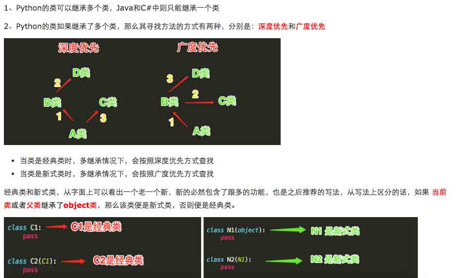

# 封装和继承

## 继承

```python
class ParentClass1: #定义父类
    pass

class ParentClass2: #定义父类
    pass

class SubClass1(ParentClass1): #单继承，基类是ParentClass1，派生类是SubClass
    pass

class SubClass2(ParentClass1,ParentClass2): #多继承，用逗号分隔开多个继承的类
    pass
```

### 查看继承 

`__base__`只查看从左到右继承的第一个子类，`__bases__`则是查看所有继承的父类

```python
>>> SubClass1.__bases__ 
(<class '__main__.ParentClass1'>,)
>>> SubClass2.__bases__
(<class '__main__.ParentClass1'>, <class '__main__.ParentClass2'>)
```

如果没有指定基类，python的类会默认继承object类，object是所有python类的基类，它提供了一些常见方法

### super类 

在类内部实例化`super()`会顺着继承链返回后一个类的实例。    
由于多继承的关系，后一个类不一定是父类。    
在python2中类内部使用`super()`时，参数不可以不写    
不省略参数的写法是：`super(cls, self)`

### 派生

子类也可以添加自己新的属性或者在自己这里重新定义这些属性（不会影响父类的属性）

```python
#继承list的mylist
class my_list(list):
    def __init__(self,*args,**kwargs):
        '''调用super().__init__()之前，列表会是空的[]'''
        print(self) # []
        super().__init__(*args,**kwargs)
    def pop(self):
        print('mypop')
        return super().pop()

l = my_list({1,2,3,}) # []
print(l.pop()) # 'mypop' 3
print(l) # [1, 2]


#继承str的mystr
class my_str(str):
    def __new__(cls,*args,**kwargs):
        """此时是空字符串<my_str ''>"""
        print(self := super().__new__(cls))
        return self
    def __init__(self,*args,**kwargs):
        '''不需要调用super().__init__()就已经构造出字符串了'''
        print(self)
    def __str__(self):
        '''这是重写的父类的魔术方法，它会被print调用'''
        return f'<my_str {self!r}>'

s = my_str(b'\xe4\xbd\xa0\xe5\xa5\xbd','utf-8') #<my_str ''> <my_str '你好'>
print(s) # <my_str '你好'>
```

::: tip 派生基本类
派生基本类时情况会比较特殊

比如上述的`str.__init__()`方法，并不需要
:::

### 抽象类与接口类

> 继承有两种用途：    
> 一：继承基类的方法，并且做出自己的改变或者扩展（代码重用）  
> 二：声明某个子类兼容于某基类，定义一个接口类Interface，接口类中定义了一些接口名（就是函数名）且并未实现接口的功能，子类继承接口类，并且实现接口中的功能

每个类需要实现一个pay方法，但是由于缺少沟通，最后一个类的pay方法写成了fuqian方法（大雾

```python
class Alipay:
    '''
    支付宝支付
    '''
    def pay(self,money):
        print('支付宝支付了%s元'%money)

class Applepay:
    '''
    apple pay支付
    '''
    def pay(self,money):
        print('apple pay支付了%s元'%money)

class Wechatpay:
    def fuqian(self,money):
        '''
        实现了pay的功能，但是名字不一样
        '''
        print('微信支付了%s元'%money)

def pay(payment,money):
    '''
    支付函数，总体负责支付
    对应支付的对象和要支付的金额
    '''
    payment.pay(money)


p = Wechatpay()
pay(p,200)   #执行会报错
```

写一个含有需要实现的方法的基类，手动报异常：`NotImplementedError`来解决开发中遇到的问题

```python
class Payment:
    def pay(self):
        raise NotImplementedError

class Wechatpay(Payment):
    def fuqian(self,money):
        print('微信支付了%s元'%money)


p = Wechatpay()  #这里不报错
pay(p,200)      #这里报错了
```

借用abc模块来实现：存在抽象方法时（即需要实现而未实现的方法），实例化的时候就会报错。

```python
from abc import ABCMeta,abstractmethod

class Payment(metaclass=ABCMeta):
    @abstractmethod
    def pay(self,money):
        pass


class Wechatpay(Payment):
    def fuqian(self,money):
        print('微信支付了%s元'%money)

p = Wechatpay() # 直接报错
```

#### **依赖倒置原则**

> 高层模块不应该依赖低层模块，二者都应该依赖其抽象；    
> 抽象不应该应该依赖细节；细节应该依赖抽象。    
> 换言之，要针对接口编程，而不是针对实现编程

接口继承实质上是要求“做出一个良好的抽象，这个抽象规定了一个兼容接口，使得外部调用者无需关心具体细节，可一视同仁的处理实现了特定接口的所有对象”——这在程序设计上，叫做归一化。

#### 钻石继承问题



它决定了属性查找的顺序即`super()`的指向

- 新式类：广度优先
- 经典类：深度优先

python3都是新式类。


#### 接口隔离原则

> 使用多个专门的接口，而不使用单一的总接口。    
> 即客户端不应该依赖那些不需要的接口。    
> 在继承抽象类的过程中，我们应该尽量避免多继承；     
> 而在继承接口的时候，我们反而鼓励你来多继承接口 


另一种派生方法的方式：**Mixin方式**

```python
class A():
	pass
class foo_Mixin():
	def foo(self):
		pass
```

定义一个Mixin类里面写好需要派生的方法    
需要派生这个方法的类，只需要多继承一个Mixin类

```python
class B(foo_Mixin, A):
	pass
B().foo()
```

由于继承链的广度优先`foo_Mixin`里使用`super()`会往`A`指


## 封装

隐藏对象的属性和实现细节，仅对外提供公共访问方式。     
在python中用双下划线开头的方式将属性隐藏起来（设置成私有的）

```python
#其实这仅仅这是一种变形操作
#类中所有双下划线开头的名称如__x都会自动变形成：_类名__x的形式：

class A:
    __N=0 #类的数据属性就应该是共享的,但是语法上是可以把类的数据属性设置成私有的如__N,会变形为_A__N
    def __init__(self):
        self.__X=10 #变形为self._A__X
    def __foo(self): #变形为_A__foo
        print('from A')
    def bar(self):
        self.__foo() #只有在类内部才可以通过__foo的形式访问到.

#A._A__N是可以访问到的，即这种操作并不是严格意义上的限制外部访问，仅仅只是一种语法意义上的变形
```

在继承中，父类如果不想让子类覆盖自己的方法，可以将方法定义为私有的

```python
#把fa定义成私有的，即__fa
>>> class A:
...     def __fa(self): #在定义时就变形为_A__fa
...         print('from A')
...     def test(self):
...         self.__fa() #只会与自己所在的类为准,即调用_A__fa
... 
>>> class B(A):
...     def __fa(self):
...         print('from B')
... 
>>> b=B()
>>> b.test()
from A
```


## 类中使用的装饰器

### property

```
例一：BMI指数（bmi是计算而来的，但很明显它听起来像是一个属性而非方法，如果我们将其做成一个属性，更便于理解）

成人的BMI数值：
过轻：低于18.5
正常：18.5-23.9
过重：24-27
肥胖：28-32
非常肥胖, 高于32
　　体质指数（BMI）=体重（kg）÷身高^2（m）
　　EX：70kg÷（1.75×1.75）=22.86
```

```python
class People:
    def __init__(self,name,weight,height):
        self.name=name
        self.weight=weight
        self.height=height
    @property
    def bmi(self):
        return self.weight / (self.height**2)

p1=People('egon',75,1.85)
print(p1.bmi)
```

属性property，由其他已有属性值动态计算得到。    
本质就是实现了get，set，delete三种方法的数据描述符

```python
class Goods:
    def __init__(self):
        # 原价
        self.original_price = 100
        # 折扣
        self.discount = 0.8

    @property
    def price(self):
        # 实际价格 = 原价 * 折扣
        new_price = self.original_price * self.discount
        return new_price

    @price.setter
    def price(self, value):
        self.original_price = value

    @price.deleter
    def price(self):
        del self.original_price


obj = Goods()
obj.price         # 获取商品价格
obj.price = 200   # 修改商品原价
print(obj.price)
del obj.price     # 删除商品原价
```

### classmethod

（狭义上的）类方法，class命名空间里定义的只和类有关，不和实例有关的函数

```python
class Classmethod_Demo():
    role = 'dog'

    @classmethod
    def func(cls):
        print(cls.role)
Classmethod_Demo.func()
```

### staticmethod

静态方法，class命名空间里定义的普通函数，常用来定义工具函数。

```python
class Staticmethod_Demo():
    role = 'dog'

    @staticmethod
    def func():
        print("当普通方法用")

Staticmethod_Demo.func()
```


## 与类有关的内置方法

```python
isinstance(obj,cls)#检查是否obj是否是类 cls 的对象
issubclass(sub, super)#检查sub类是否是 super 类的派生类
```


## 反射

python面向对象中的反射：通过字符串的形式操作对象相关的属性。python中的一切事物都是对象（都可以使用反射）

```python
class Foo:
    f = '类的静态变量'
    def __init__(self,name,age):
        self.name=name
        self.age=age

    def say_hi(self):
        print('hi,%s'%self.name)

obj=Foo('egon',73)

#检测是否含有某属性
print(hasattr(obj,'name'))
print(hasattr(obj,'say_hi'))

#获取属性
n=getattr(obj,'name')
print(n)
func=getattr(obj,'say_hi')
func()

print(getattr(obj,'aaaaaaaa','不存在啊')) #报错

#设置属性
setattr(obj,'sb',True)
setattr(obj,'show_name',lambda self:self.name+'sb')
print(obj.__dict__)
print(obj.show_name(obj))

#删除属性
delattr(obj,'age')
delattr(obj,'show_name')
delattr(obj,'show_name111')#不存在,则报错

print(obj.__dict__)
```

反射当前模块成员 

```python
#!/usr/bin/env python
# -*- coding:utf-8 -*-
import sys

def s1():
    print 's1'

def s2():
    print 's2'

this_module = sys.modules[__name__]

hasattr(this_module, 's1')
getattr(this_module, 's2')
```
